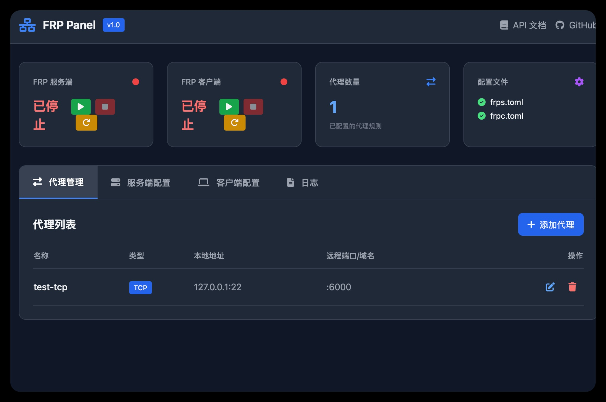

# FRP Panel - 一个轻量级的 FRP 内网穿透管理面板

<p align="center">
  
</p>

<h3 align="center">FRP Panel</h3>

<p align="center">
  一个轻量、现代化、开箱即用的 FRP (Fast Reverse Proxy) 管理面板，助您轻松管理内网穿透代理。
  <br />
  <a href="#-快速开始"><strong>快速开始 »</strong></a>
  ·
  <a href="https://github.com/ychenfen/frp-panel/issues">报告 Bug</a>
  ·
  <a href="https://github.com/ychenfen/frp-panel/issues">提出新特性</a>
</p>

<p align="center">
  
  
  
  
</p>

---

## ✨ 项目简介

`FRP` 是一款优秀的高性能反向代理应用，但其基于配置文件的管理方式对新手不够友好，且在代理规则较多时难以维护。`FRP Panel` 正是为了解决这一痛点而生。

`FRP Panel` 提供了一个美观、易用的 Web 界面，让您可以通过点击几下鼠标就完成 FRP 服务端和客户端的配置、代理的增删改查、服务的启停以及日志的查看。项目后端基于 `FastAPI`，前端使用 `Vue 3` 和 `TailwindCSS`，并提供了完整的 `Docker` 化部署方案，让您可以在几分钟内搭建起属于自己的内网穿透管理服务。

## 🚀 主要特性

- **🖥️ 现代化 UI**：基于 Vue 3 和 TailwindCSS 构建，美观、响应式，体验流畅。
- **⚡ 一键部署**：提供 `install.sh` 脚本，无需 Docker 也能快速部署；同时提供 `docker-compose.yml`，实现一键容器化部署。
- **✅ 服务状态监控**：在 Web 界面实时查看 `frps` 和 `frpc` 的运行状态、PID 等信息。
- **🔧 配置管理**：通过 Web 表单轻松修改 `frps.toml` 和 `frpc.toml` 的核心配置。
- **🔄 代理管理**：支持 TCP, UDP, HTTP, HTTPS 类型的代理，提供完整的增、删、改、查功能。
- **📜 日志查看**：直接在前端查看 `frps` 和 `frpc` 的实时日志。
- **🐳 全面 Docker 化**：从开发到部署，提供完整的 Docker 支持，干净又卫生。
- **📖 API 友好**：后端基于 FastAPI，自动生成交互式 API 文档 (Swagger UI)。

## 📸 界面截图

<p align="center">
  
</p>

<p align="center"><em>FRP Panel 仪表盘 - 深色主题，现代化设计</em></p>

## ⚡ 快速开始

我们提供两种部署方式：**Shell 脚本部署** (推荐用于无 Docker 环境) 和 **Docker Compose 部署** (推荐)。

### 方式一：Docker Compose 部署 (推荐)

这是最简单、最推荐的部署方式。

1.  **克隆本项目**

    ```bash
    git clone https://github.com/ychenfen/frp-panel.git
    cd frp-panel
    ```

2.  **修改配置**

    打开 `docker-compose.yml` 文件，修改 `environment` 部分的配置，特别是 `FRPS_TOKEN`，请务必将其更改为一个安全的随机字符串。

    ```yaml
    services:
      frp-server:
        # ...
        environment:
          - FRPS_TOKEN=your_secure_token_here # <-- 修改这里
        # ...
    ```

3.  **启动服务**

    ```bash
    docker compose up -d
    ```

4.  **访问面板**

    现在，您可以通过 `http://YOUR_SERVER_IP:8000` 访问 FRP Panel 的管理界面了。

### 方式二：Shell 脚本部署

如果您的服务器没有安装 Docker，可以使用我们提供的一键部署脚本。

1.  **下载脚本**

    ```bash
    wget https://raw.githubusercontent.com/ychenfen/frp-panel/main/scripts/install_frp.sh
    ```

2.  **运行脚本**

    ```bash
    sudo bash install_frp.sh
    ```

3.  **根据提示操作**

    脚本会引导您安装 FRP 服务端或客户端，并自动创建 `systemd` 服务。安装完成后，您需要手动部署 Web 面板。

    *(注意：此方式仅安装 FRP 服务，Web 面板需要您手动配置并运行 `backend/main.py`)*

## ⚙️ 配置

### Docker 环境变量

您可以通过修改 `docker-compose.yml` 中的环境变量来配置 FRP Panel。

| 变量 | 默认值 | 描述 |
| :--- | :--- | :--- |
| `FRP_MODE` | `server` | 容器运行模式。`server` 或 `client`。 |
| `FRPS_BIND_PORT` | `7000` | FRP 服务端绑定端口。 |
| `FRPS_DASHBOARD_PORT` | `7500` | FRP 原生 Dashboard 端口。 |
| `FRPS_DASHBOARD_USER` | `admin` | Dashboard 用户名。 |
| `FRPS_DASHBOARD_PWD` | `admin123` | Dashboard 密码。 |
| `FRPS_TOKEN` | `frp_panel_token` | **强烈建议修改**。认证 Token。 |
| `FRPC_SERVER_ADDR` | `127.0.0.1` | (客户端模式) FRP 服务器地址。 |
| `FRPC_SERVER_PORT` | `7000` | (客户端模式) FRP 服务器端口。 |
| `FRPC_TOKEN` | `frp_panel_token` | (客户端模式) 认证 Token。 |

## 🏗️ 项目结构

```
frp-panel/
├── assets/               # 项目截图和资源文件
├── backend/              # FastAPI 后端代码
│   ├── main.py
│   └── requirements.txt
├── frontend/             # Vue 前端代码 (单文件 HTML)
│   └── index.html
├── docker/               # Docker 相关文件
│   ├── Dockerfile
│   └── entrypoint.sh
├── scripts/              # 部署脚本
│   └── install_frp.sh
├── .gitignore
├── docker-compose.yml    # Docker Compose 配置文件
└── README.md             # 就是你现在看到的这个文件
```

## 🤝 贡献

我们非常欢迎各种形式的贡献！如果您有任何想法、建议或发现了 Bug，请随时提交 [Issues](https://github.com/ychenfen/frp-panel/issues)。

如果您想贡献代码，请遵循以下步骤：

1.  Fork 本仓库
2.  创建您的特性分支 (`git checkout -b feature/AmazingFeature`)
3.  提交您的修改 (`git commit -m 'Add some AmazingFeature'`)
4.  推送到分支 (`git push origin feature/AmazingFeature`)
5.  开启一个 Pull Request

## 📄 许可证

本项目使用 MIT 许可证。详情请见 `LICENSE` 文件。

---

*Made with ❤️ by ychenfen and the community.*
